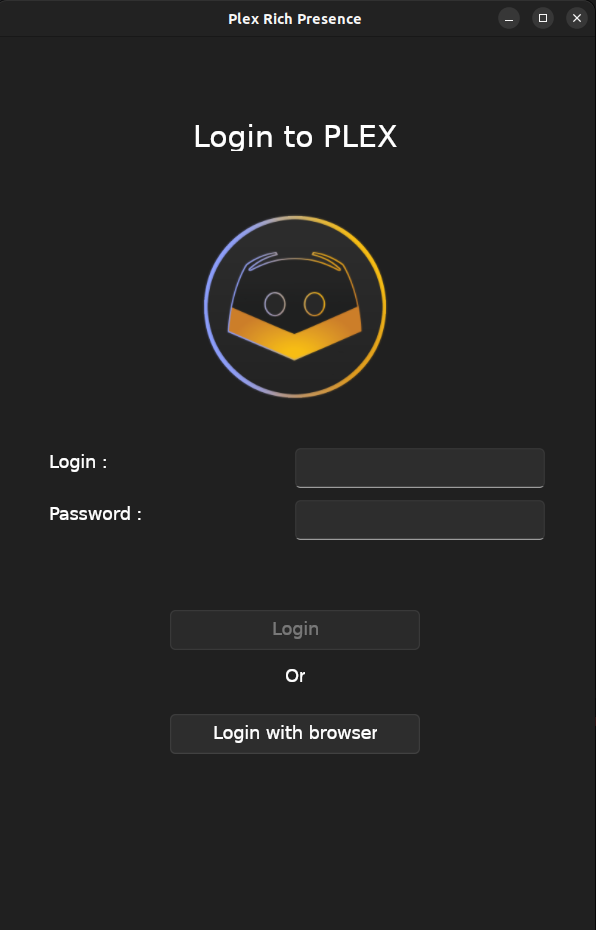
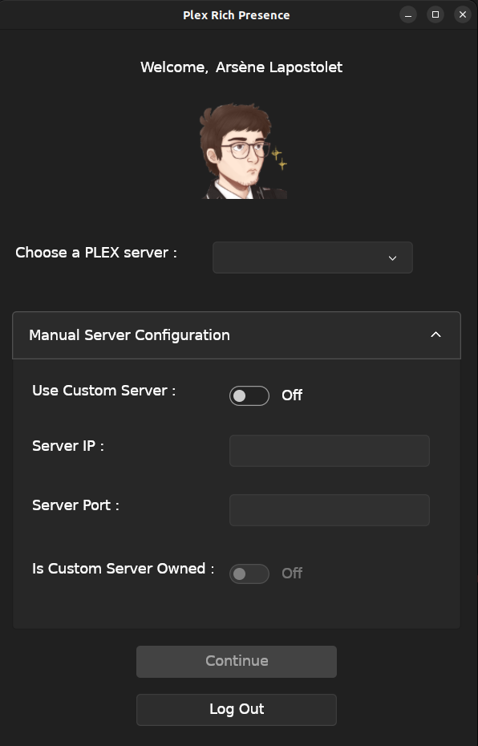
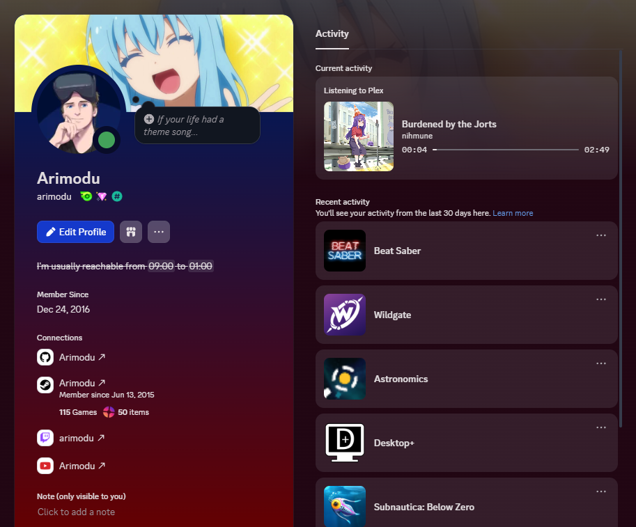

# Plex Rich Presence

Plex Rich Presence is a multiplatform .NET 6 GUI App that allows you to display your current PLEX session in your Discord Rich presence status.


New features from version 2.0 : 

- Supports non-admin users
- Supports choosing a server
- CLI version
- PLEX SSO Login

## Release Version

- [Portable DLL](https://github.com/Ombrelin/plex-rich-presence/releases/latest/download/plex-rich-presence.jar)
- [Windows Installer](https://github.com/Ombrelin/plex-rich-presence/releases/latest/download/plex-rich-presence-setup.exe)
- [Linux (Debian) package]()

You can also install the windows version using the WinGet package manager : 

```
winget install PlexRichPresence
```

## Screenshots







## Build & Run form sources

Requires .NET 6+ SDK

```
cd src/PlexRichPresence.UI.Avalonia
dotnet run
```

## Libraries used

- [AvaloniaUI]()
- [.NET MVVM Toolkit]()
- [Microsoft DI]()
- [Moq]()
- [PlexApi]()
- [Discord RPC .NET]()
- [FluentAssertions]()

## Special Thanks

[@GrandKhan] for the logo

Thanks to [Discord](https://discord.com/) and [PLEX Media Server](https://plex.tv)
