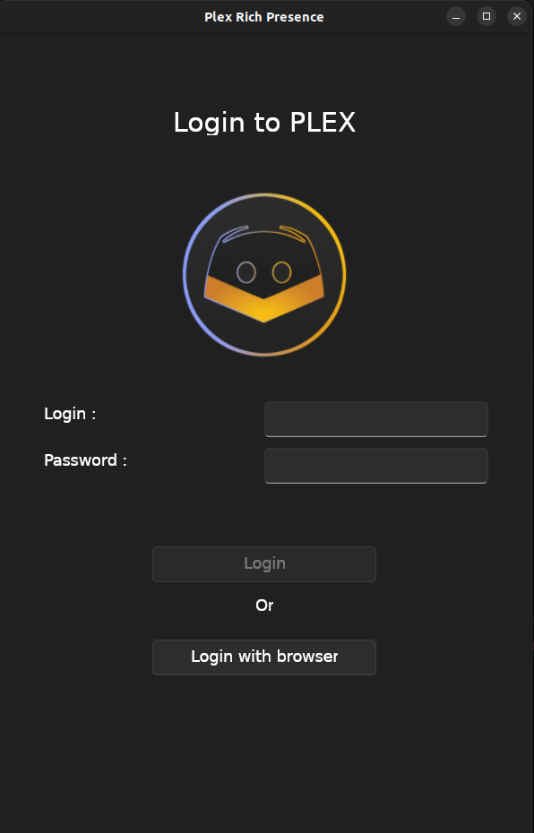
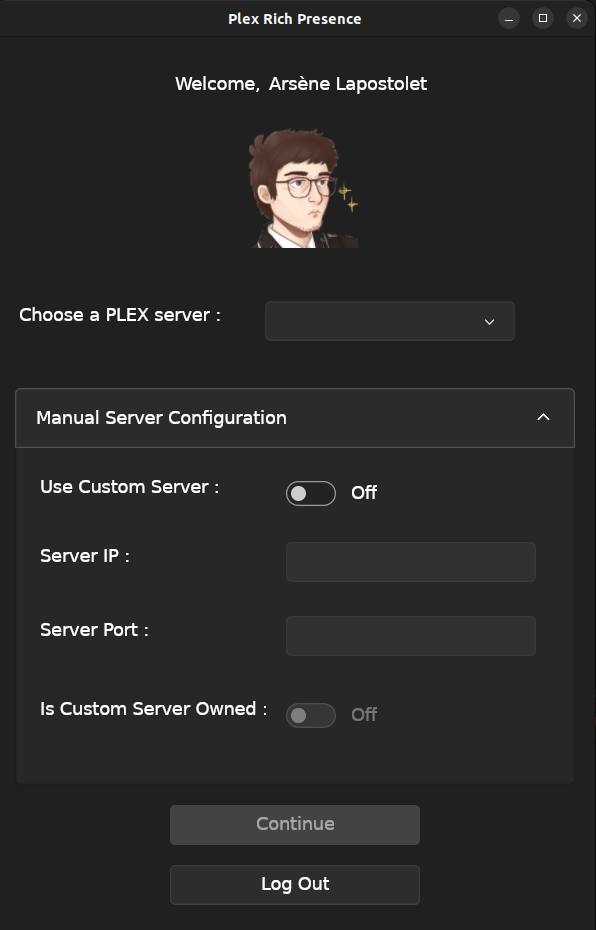
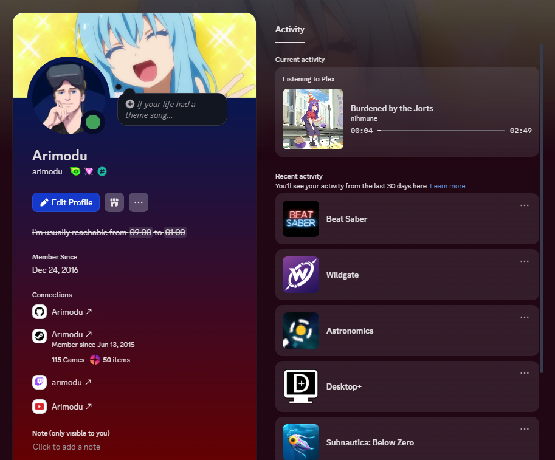

<div align="right">
  <details>
    <summary >🌐 Language</summary>
    <div>
      <div align="center">
        <a href="https://openaitx.github.io/view.html?user=Ombrelin&project=plex-rich-presence&lang=en">English</a>
        | <a href="https://openaitx.github.io/view.html?user=Ombrelin&project=plex-rich-presence&lang=zh-CN">简体中文</a>
        | <a href="https://openaitx.github.io/view.html?user=Ombrelin&project=plex-rich-presence&lang=zh-TW">繁體中文</a>
        | <a href="https://openaitx.github.io/view.html?user=Ombrelin&project=plex-rich-presence&lang=ja">日本語</a>
        | <a href="https://openaitx.github.io/view.html?user=Ombrelin&project=plex-rich-presence&lang=ko">한국어</a>
        | <a href="https://openaitx.github.io/view.html?user=Ombrelin&project=plex-rich-presence&lang=hi">हिन्दी</a>
        | <a href="https://openaitx.github.io/view.html?user=Ombrelin&project=plex-rich-presence&lang=th">ไทย</a>
        | <a href="https://openaitx.github.io/view.html?user=Ombrelin&project=plex-rich-presence&lang=fr">Français</a>
        | <a href="https://openaitx.github.io/view.html?user=Ombrelin&project=plex-rich-presence&lang=de">Deutsch</a>
        | <a href="https://openaitx.github.io/view.html?user=Ombrelin&project=plex-rich-presence&lang=es">Español</a>
        | <a href="https://openaitx.github.io/view.html?user=Ombrelin&project=plex-rich-presence&lang=it">Italiano</a>
        | <a href="https://openaitx.github.io/view.html?user=Ombrelin&project=plex-rich-presence&lang=ru">Русский</a>
        | <a href="https://openaitx.github.io/view.html?user=Ombrelin&project=plex-rich-presence&lang=pt">Português</a>
        | <a href="https://openaitx.github.io/view.html?user=Ombrelin&project=plex-rich-presence&lang=nl">Nederlands</a>
        | <a href="https://openaitx.github.io/view.html?user=Ombrelin&project=plex-rich-presence&lang=pl">Polski</a>
        | <a href="https://openaitx.github.io/view.html?user=Ombrelin&project=plex-rich-presence&lang=ar">العربية</a>
        | <a href="https://openaitx.github.io/view.html?user=Ombrelin&project=plex-rich-presence&lang=fa">فارسی</a>
        | <a href="https://openaitx.github.io/view.html?user=Ombrelin&project=plex-rich-presence&lang=tr">Türkçe</a>
        | <a href="https://openaitx.github.io/view.html?user=Ombrelin&project=plex-rich-presence&lang=vi">Tiếng Việt</a>
        | <a href="https://openaitx.github.io/view.html?user=Ombrelin&project=plex-rich-presence&lang=id">Bahasa Indonesia</a>
        | <a href="https://openaitx.github.io/view.html?user=Ombrelin&project=plex-rich-presence&lang=as">অসমীয়া</
      </div>
    </div>
  </details>
</div>

> [!WARNING]  
>  **Status of the project**
> This project in in maintenance only-mode. As I'm not a PLEX user anymore, I won't be working on new features for this project.
> However, I will still review and integrate contributions, feel free to send a PR if you want to develop a specific feature.

# Plex Rich Presence

Plex Rich Presence is a multiplatform .NET 6 GUI App that allows you to display your current PLEX session in your Discord Rich presence status.


New features from version 2.1 :

- Display media thumbnails dynamically on rich presence

New features from version 2.0 : 

- Supports non-admin users
- Supports choosing a server
- CLI version
- PLEX SSO Login

## Release Version

Releases for windows and linux can be found [here](https://github.com/Ombrelin/plex-rich-presence/releases/latest)

## Screenshots







## Build & Run form sources

Requires .NET 8+ SDK

```
cd src/PlexRichPresence.UI.Avalonia
dotnet run
```

## Libraries used

- AvaloniaUI
- .NET MVVM Toolkit
- Microsoft DI
- Moq
- PlexApi
- Discord RPC .NET
- FluentAssertions

## Special Thanks

[@GrandKhan] for the logo

Thanks to [Discord](https://discord.com/) and [PLEX Media Server](https://plex.tv)
