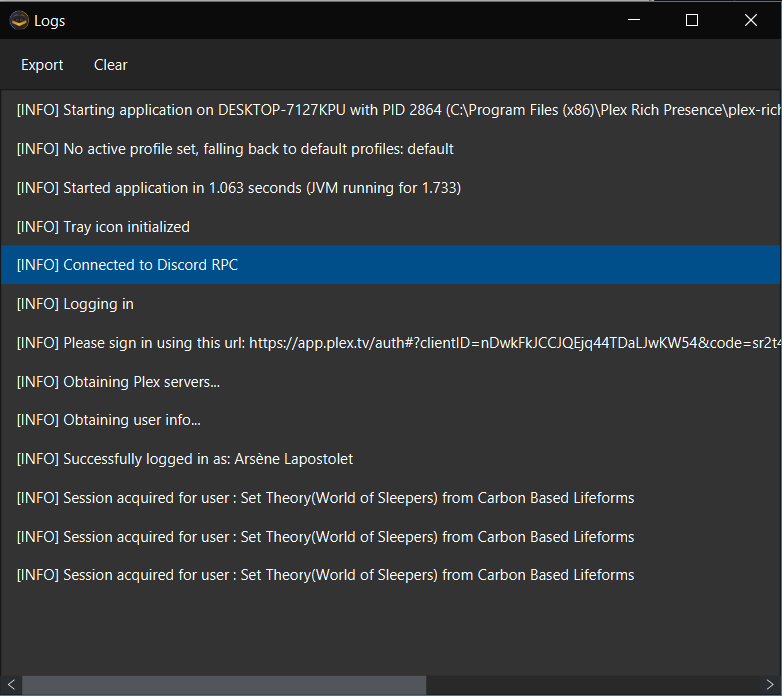

# Plex Rich Presence

Plex Rich Presence is a multiplatform Java GUI App that allows you to display your current PLEX session in your Discord Rich presence status.
Plex Rich Presence works with Java 11+. A JRE 11 is now bundled with the Windows version.


## Release Version

- [Portable and Executable JAR](https://github.com/Ombrelin/plex-rich-presence/releases/latest/download/plex-rich-presence.jar)
- [Windows Installer](https://github.com/Ombrelin/plex-rich-presence/releases/latest/download/plex-rich-presence-setup.exe)

You can also install the windows version using the WinGet package manager : 

```
winget install PlexRichPresence
```

(chocolatey comming soon)

## Screenshots





## Build

Just run :

```
mvn clean package
```

## Run 

Once build, you can run the app by running :

```
java -jar ./target/plex-rich-presence-1.6.jar
```

## Libraries used

- JavaFX
- [RxJava](https://github.com/ReactiveX/RxJava)  
- [Spring Boot](https://github.com/spring-projects/spring-boot)
- [FxWeaver](https://github.com/rgielen/javafx-weaver)
- [JMetro](https://github.com/JFXtras/jfxtras-styles)
- [Java Discord RPC](https://github.com/MinnDevelopment/java-discord-rpc)
- [Retrofit 2](https://github.com/square/retrofit)
- [Project Lombok](https://github.com/rzwitserloot/lombok)

## Special Thanks

Thanks to [Discord](https://discord.com/) and [PLEX Media Server](https://plex.tv)
